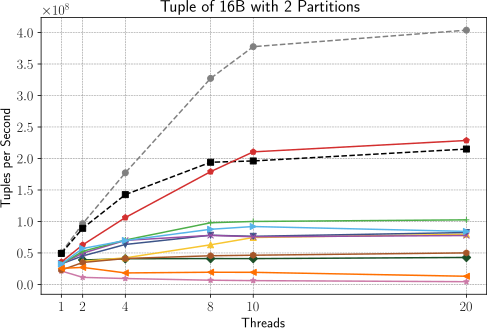
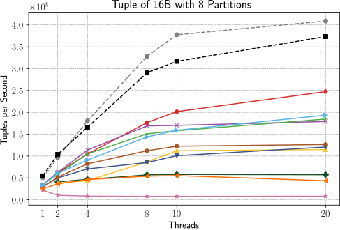
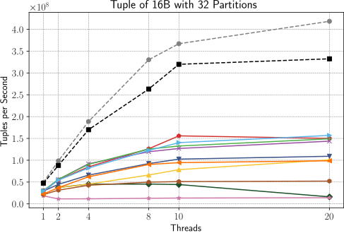
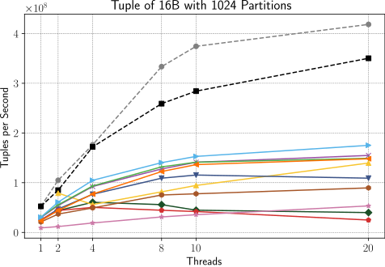
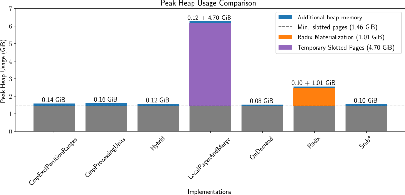

# Bachelor Thesis – Implementing an Efficient Shuffle Operator for Streaming Database Systems

## Abstract

Modern streaming database systems rely on efficient data partitioning to achieve
scalability and high performance across processing nodes. Partitioned data shuffling is
a crucial operation, as it is used to prepare and distribute data for further processing
on distributed systems.

This thesis purposes and evaluates various partitioning implementations by simulating real-world usage of the shuffle operator. The implementations process incoming
tuple batches and partition them into output buckets, which are based on slotted pages
and can be passed to subsequent operators. The evaluation of the implementations is
based on their performance, scalability and memory consumption.

We evaluate 10 shuffle operator implementations and identify two highly efficient
approaches: (1) thread-local slotted pages with merging, optimal for fewer than 32 partitions, and (2) a group of Software Managed Buffer (SMB) implementations excelling
beyond 16 partitions. Throughput and scalability analyses show that the thread-local
slotted page approach achieves up to 2.1x higher performance for low partition counts,
while the SMB group scales efficiently, outperforming other methods by 2.4x for high
partition counts.

## Evaluation Plots

The following plots are part of the evaluation of the shuffle operator implementations. The plots show the throughput and memory consumption of the shuffle operator implementations.

### Throughput

To measure the throughput of the shuffle operator implementations, we ran a series of experiments with varying numbers of partitions and threads. The throughput is measured in tuples per second and is plotted against the number of partitions.

We added two best-case upper bounds to the plots: Both upper bounds implementations use a pre-partitioned input stream, which allows both implementation to fully utilize the write-out buffers without having to partition the input stream. The `unsync` line represents the throughput of the ideal shuffle operator where no synchronization is performed. On the other hand, the `sync` line represents the throughput of the ideal shuffle operator where the slotted pages are shared among all threads.

In the 2 partition case, the `LocalPagesAndMerge` implementation achieves the highest throughput. This is the case because the implementation uses thread-local slotted pages and merges them at the end of the shuffle operation. This `LocalPagesAndMerge` implementation is followed by the `Smb*` implementations, which use simple approach based on Software Managed Buffers (SMB).

Otherwise, only the `CmpProcessingUnits` implementation is able to scale with increasing threads. But there is a significant performance gap when using only a few threads. The remaining implementations are not able to scale with increasing threads in the 2 partition case.

With increasing partition counts, the `LocalPagesAndMerge` implementation starts to struggle. The `Smb*` implementations, on the other hand, scale well and achieve higher throughput.

When running the benchmarks with 32 partitions, the gap between the `LocalPagesAndMerge` and the `Smb*` implementations closes.

The `Smb*` implementations outperform all other implementations when running the benchmarks with 1024 partitions. The `LocalPagesAndMerge` fails to scale, as the number of thread-local slotted pages grows with the number of partitions and threads. This causes the translation lookaside buffer (TLB) to be exhausted, which results in a performance drop.

### Memory Consumption

We measured the peak heap memory consumption of the shuffle operator implementation during a run with 1 GiB of input data. The run was executed with 32 partitions and 40 threads.

We see that most implementations barely consume any additional memory compared to the minimal slotted page memory overhead. The LocalPagesAndMerge variant uses the most memory, as it creates a separate slotted page for each thread and partition. The Radix variant has to materialize the input data, which results in a higher memory consumption.

## Implementation and Thesis

The implementation of the shuffle operators can be found in the `implementation` submodule. The thesis is available in the `thesis` submodule.
